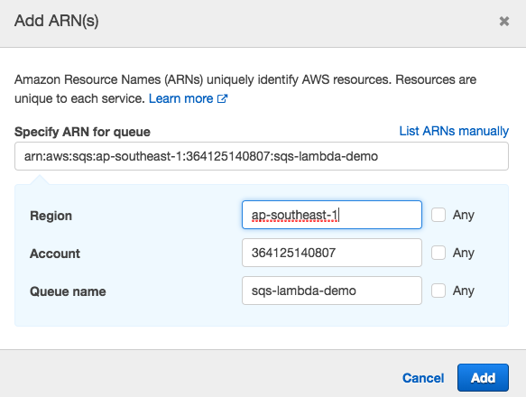

# AWS API Gateway Proxy for SQS (Simple Queue System)

If you came across a situation where you need to process API Request asynchronously and you want to add a queue in your application, you landed to right place.

This article shows how to Integrate Amazon API Gateway as proxy for SQS (Simple Queue System).

1. 
      
