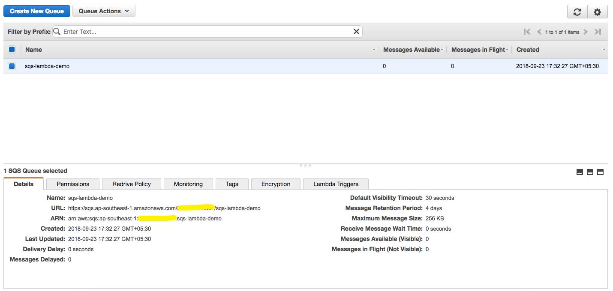

# AWS API Gateway Proxy for SQS (Simple Queue Service)

If you came across a situation where you need to process API Request asynchronously and you want to add a queue in your application, you landed to right place.

This article shows how to Integrate Amazon API Gateway as proxy for SQS (Simple Queue Service).

###1. create SQS queue 

1.1 Open AWS console in services navigate to Simple Queue Service.
1.2 Click on "Create New Queue"
1.3 Give queue a name, in our case it is "sqs-lambda-demo" and hit "Create Queue"

