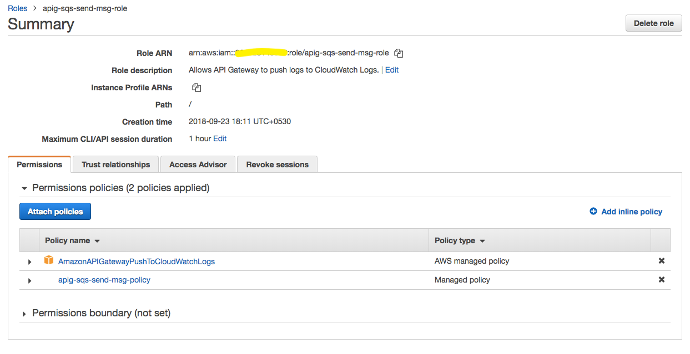
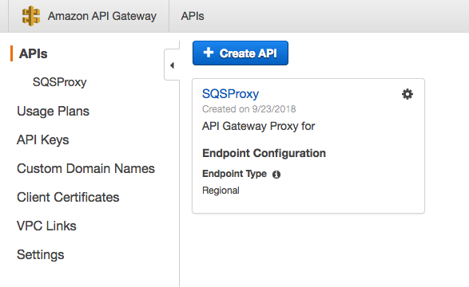

# AWS API Gateway Proxy for SQS (Simple Queue Service)

If you came across a situation where you need to process API Request asynchronously and you want to add a queue in your application, you landed to right place.

This article shows how to Integrate Amazon API Gateway as proxy for SQS (Simple Queue Service).

### 1. Create a SQS queue ###

1.1. Open AWS console in services navigate to Simple Queue Service. <br />
1.2. Click on "Create New Queue" <br />
1.3. Give queue a name, in our case it is "sqs-lambda-demo" and hit "Create Queue" <br />
1.4. Remember Queue URL (AWS-ACCT-ID/queue-name) and Queue ARN (AWS-ACCT-ID:queue-name)


### 2. Create IAM Policy ###

We will create IAM Policy and Role for AWS API Gateway to push Request Message to Queue.
2.1. Select IAM, Navigate to "policies" and click on "Create Policy"
2.2. Open JSON editor and add the following policy
2.3. click on "Review Policy", name policy as "apig-sqs-send-msg-policy" and hit "Create Policy"

```json
{
    "Version": "2012-10-17",
    "Statement": [
        {
            "Sid": "VisualEditor0",
            "Effect": "Allow",
            "Action": "sqs:SendMessage",
            "Resource": "arn:aws:sqs:ap-southeast-1:123456789:sqs-lambda-demo"
        }
    ]
} 
```

### 3. Create IAM Role ###

3.1. Select IAM, Navigate to "Roles" and click on "Create Role"
3.2. Select "API Gateway" and click "Next:Permissions"

3.3. Give a name to the role you created. In my case, it's "apig-sqs-send-msg-role", notice that only attached policy is "AmazonAPIGatewayPushToCloudWatchLogs".

3.4. Once role is created, edit the role and attach "apig-sqs-send-msg-policy" 



### 4. Create an API ###

3.1. Select API Gateway, click on "Create API", name api as "SQSProxy" and hit "Create".

3.2. Click on "Action" and "create resource" and resource as "v1".
3.3. Click on "v1", and hit "action > create resource" to create "enqueue".
3.4. Click on "enqueue" and hit "action > create method" and from dropdown select "POST".


### 5. Integrate the API ###
